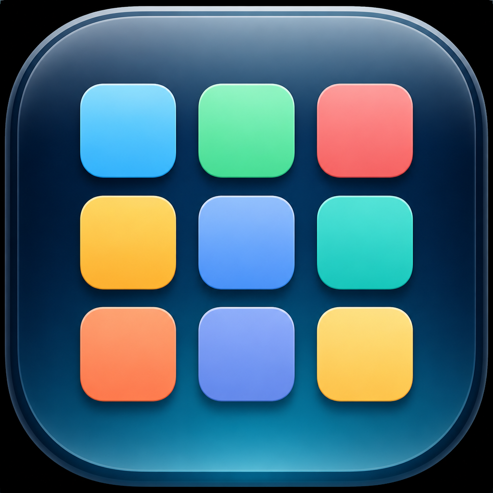

# OpenLaunchpad

**macOS Tahoe Launchpad alternative / macOS 26 启动台替代**

<p align="center">
  
</p>

<p align="center">
  <a href="https://github.com/voncoding/OpenLaunchpad/releases/latest"></a>
  <a href="https://github.com/voncoding/OpenLaunchpad/releases"></a>
  <a href="LICENSE"></a>
</p>

OpenLaunchpad is a **native Launchpad replacement for macOS Tahoe (macOS 26)** after Apple removed the system Launchpad.  
It restores a familiar full-screen app launcher with search, paging, and drag-to-reorder.

**OpenLaunchpad** 是面向 **macOS Tahoe（macOS 26）** 的原生启动台替代应用：全屏应用网格、拼音搜索、翻页与拖拽排序。

[Download latest release](https://github.com/voncoding/OpenLaunchpad/releases/latest) · [中文说明](#安装-install)

本次更新 **v1.1.0**：文件夹、独立分页及翻页边缘修复。详见 [更新日志 / Changelog](CHANGELOG.md)。

---

## Why OpenLaunchpad

- macOS Tahoe removed Launchpad — this brings it back as a lightweight native app
- Blurred desktop wallpaper overlay (Dock & menu bar auto-hide only inside a folder)
- Chinese name / Pinyin / initials search
- Trackpad paging + mouse drag on empty space
- Icon reorder with remembered page

适合关键词检索：`Launchpad alternative`、`macOS Tahoe Launchpad`、`macOS 26 启动台`、`Launchpad replacement`、`open source Launchpad`。

---

## Features 功能

| 中文 | English |
|------|---------|
| 全屏网格，模糊当前桌面壁纸 | Full-screen grid over a blurred desktop wallpaper |
| 扫描 `/Applications`、系统与用户应用 | Scans `/Applications`, system, and user app folders |
| 中文名 / 拼音 / 首字母搜索 | Search by Chinese name, Pinyin, or initials |
| 触控板两指翻页；空白处鼠标拖动翻页 | Trackpad two-finger paging; drag empty space with the mouse |
| 拖拽图标重排，顺序会记住 | Drag icons to reorder; order is persisted |
| 记住上次停留的页 | Remembers the last page you were on |
| 快捷键 ⌥⌘L，菜单栏常驻 | Hotkey ⌥⌘L; lives in the menu bar |
| 支持登录时启动 | Optional launch at login |

---

## Requirements 系统要求

- macOS 26.0+（Tahoe）
- Apple Silicon or Intel

---

## Install 安装

1. Open the [latest Release](https://github.com/voncoding/OpenLaunchpad/releases/latest)
2. Download `OpenLaunchpad.zip` and unzip
3. Move `OpenLaunchpad.app` (display name: **启动台**) to Applications or `~/Applications`
4. If macOS blocks it: System Settings → Privacy & Security → Open Anyway

```bash
# Build from source
xcodebuild -project Launchpad.xcodeproj -scheme Launchpad \
  -configuration Release -derivedDataPath build/DerivedData ONLY_ACTIVE_ARCH=YES
# Output: build/DerivedData/Build/Products/Release/OpenLaunchpad.app
```

---

## Usage 使用

- **Open**：⌥⌘L, menu bar grid icon, or Dock icon  
- **Close**：Esc, or click empty space  
- **Search**：click the search field first (no auto-focus)  
- **Page**：trackpad swipe, or drag on gaps between icons  
- **Reorder**：drag an icon to a new position and release; hold near a page edge to move between pages
- **Folders**：pause over the center of another icon until it highlights, then release to create or join a folder
- **Move out of a folder**：drag an app outside the folder panel and release; it returns beside the folder
- **Keyboard**：arrow keys select apps; Return opens the selection, including folders; Escape cancels a drag before closing the folder or launcher

拖放即可排序；在目标图标中心稍作停留、出现高亮后松手，可创建文件夹或放入已有文件夹。拖到页面边缘稍停可跨页移动，按 Escape 可取消。文件夹内应用较多时可以滚动，拖出面板可移回主网格。

每页独立保存：移走图标、合并文件夹或卸载应用后，当前页底部可以留空，不会从下一页自动补齐；重新打开后仍保留分页。新安装的应用添加到最后一页。

文件夹采用接近原生启动台的宽幅浅灰面板，最多显示四行，更多应用可滚动查看，滚动条隐藏。仅展开文件夹时，程序坞和菜单栏会自动隐藏；回到主网格后恢复。

每次打开时重新读取当前壁纸，并做模糊、压暗处理。支持读取“照片”来源壁纸对应的系统缓存原图，避免错误显示系统默认壁纸。

开发时运行 `./scripts/test-interactions.sh` 可检查拖拽、文件夹、搜索选择、页码恢复和扫描刷新等关键交互。测试使用隔离的数据，不会启动其他应用或改动现有排序。

---

## Stack 技术栈

SwiftUI + AppKit hybrid: borderless overlay window, AppKit-driven paging, SwiftUI grid & search.

---

## FAQ

**Is this the official Apple Launchpad?**  
No. It is an independent open-source alternative for macOS Tahoe.

**Can I use a custom domain?**  
The GitHub repository itself cannot bind a domain. You can host a simple landing page with **GitHub Pages** (e.g. `docs/` or `gh-pages`) and point your domain there, linking to Releases for downloads.

**Gatekeeper warning?**  
Unsigned / ad-hoc signed builds may need “Open Anyway” in Privacy & Security.

---

## License

MIT
